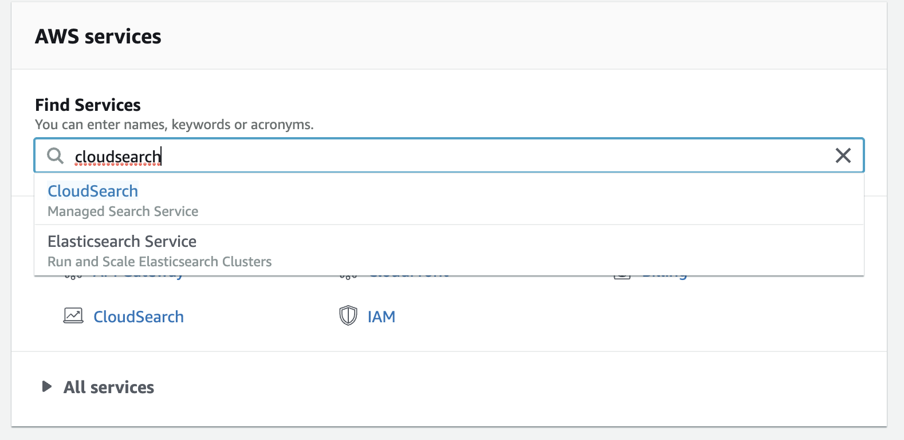
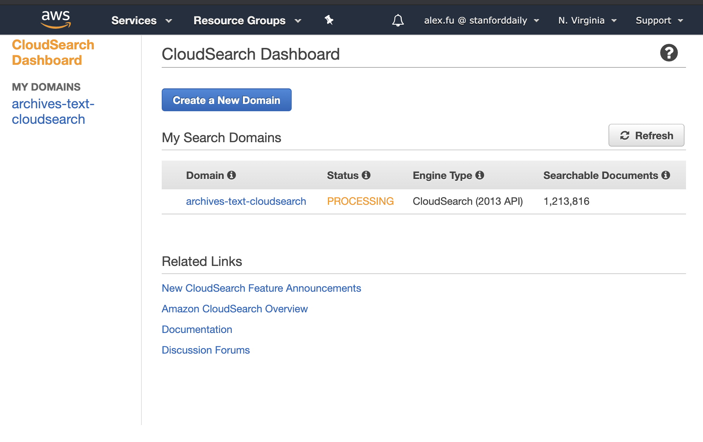
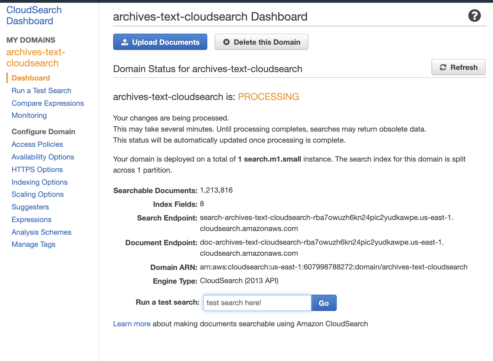
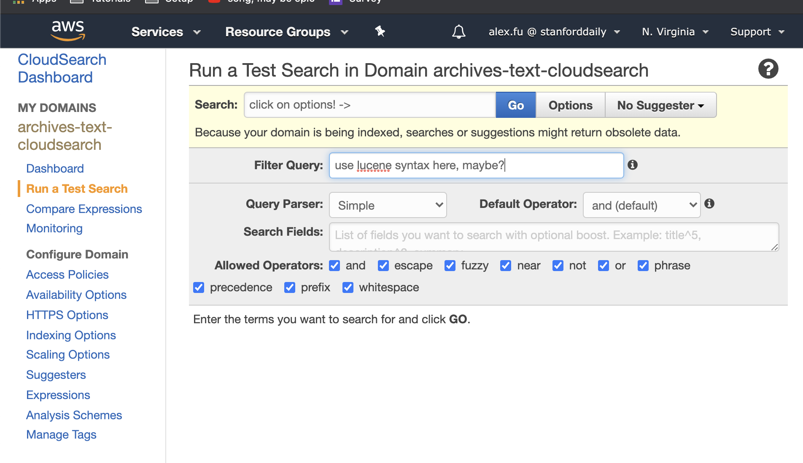

Several things power archives on the backend, and they're each located in different spots.

These things include:
- responding to frontend fetching search results
- responding to frontend fetching article text
- responding to frontend fetching issue images
- responding to frontend submitting corrections to articles

## Responding to frontend fetching search results
When the frontend makes a search request, they are directly interacting with an aws API Gateway. Read more about API Gateways below. The API Gateway then routes the frontend's request to the CloudSearch endpoint, at which point the server backing the CloudSearch endpoint will process the search query and then respond to API Gateway with the results. API Gateway then forwards this back to the frontend. You can read more about CloudSearch below.

## Responding to frontend fetching article text
The canonical source (i.e. "source of truth") for archives article text is the `archives-text` github repo which can be found [here](https://github.com/thestanforddaily/archives-text). This is a massive repo (~10GB of data) and since Git doesn't scale well, it's a pain to work with. So if you ever need to work with it (which is likely as the articles text still have quite a few errors), just know that git actions like `git status` will take a very long time (I wouldn't be surprised if it took an hour to `git add` or `git commit`). Also don't use `zsh` when browsing this repo on your local machine because `zsh` doesn't scale well with large directories. 

When fetching article text on the frontend (e.g. when you go to an article and see the corresponding text to that article in the side bar), this text comes from the archives-text repository. The backend is really all handled by github and their API. The only thing that concerns us here is ensuring that this repo's data is up to date.

## Responding to frontend fetching issue images
Issue images are fetched on the frontend by OpenSeadragon. OpenSeadragon fetches tiled images that come from a CloudFront distribution; this distribution serves images from the stanforddailyarchive-tiled S3 bucket.

The original (non-tiled) images of article pages, PDFs of issues, as well as the original METS / ALTO files (with transcriptions), can be found on the stanforddailyarchive S3 bucket.

## Responding to frontend submitting corrections to articles
The frontend corrections form is powered by google forms. We're using an embedded form. Checkout [this](https://trevorfox.com/2015/06/dynamically-pre-fill-google-forms-with-mailchimp-merge-tags/) for more details. You can see the google form [here](https://docs.google.com/forms/d/e/1FAIpQLSf8BdqmWzBnOTVg9AS_diCDUbLO-JB3T_BJHo72PzwQGZo5oQ/viewform?embedded=false)

## CloudSearch
CloudSearch is a search engine service by AWS which powers the archives search functionality. CloudSearch is powered by Apache Solr. 

To "see" CloudSearch, go to `aws.amazon.com` and sign in. Then, in the find services search bar, search for CloudSearch. Once there, there should be a `archives-text-CloudSearch` domain. If you click on it, you can interact with the CloudSearch through aws's interface. Here you can search the data set as well as configure the data set and Cloudsearch Instance. This is the best place in my opinion to configure the Cloudsearch Instance. Note that you don't need to use AWS's own interface to do these things. Amazon provides APIs which we can do these things programmatically. 

Here are some images which are more descriptive. 

1. Open [AWS console](http://console.aws.amazon.com/) and find CloudSearch
   
2. Cloudsearch Dashboard (clicking on the CloudSearch search suggestion in previous image brings us here)
    
3. Archives Text Cloudsearch Dashboard (clicking on "archives-text-cloudsearch" in previous image brings us here)
    
4. Archives Text Cloudsearch Test Search Dashboard (clicking on "Run a Test Search" in the side bar of previous image brings us here)
   

As previously discussed, the archives-text repo is the canonical source of archives-text information. However, it is not the only source where archives-text information is stored. The other place that article text is stored is in CloudSearch. In CloudSearch, there is an article-text field. All of this data should be the same as the archives-text repo. But be careful, because the two sources of data are in no way synced. If you change data in one place, be sure to change it in another. Typically the workflow is: make changes to the archives-text repo, then run the data upload scripts described below to sync data to CloudSearch. This isn't ideal. Perhaps it can be done automatically. Another idea would to have just a single source of article-text data. 

We interact with CloudSearch programmatically in two ways:

- Searching
- Uploading Data

### Searching
Searching is pretty simple. You just submit a query to an endpoint in the form of a http request and the endpoint responds with the search results. 

### Uploading data
We have around 10GB of article text data in the archives-text repository and we need to upload that data to CloudSearch so that it has the data which we are searching over. There are python scripts which upload this data to CloudSearch in the archives-scripts repository. You can find them [here](https://github.com/thestanforddaily/archives-scripts) and [here](https://github.com/TheStanfordDaily/archives-scripts/tree/master/CloudSearch). These two sources have a bit more documentation about CloudSearch, so go there to find out more.

## API Gateway
Unfortunately, CloudSearch doesn't allow cross origin requests to its endpoint. What this means is that we can't directly query the CloudSearch endpoint from the archives frontend. As a result, we need to setup an AWS API gateway for the CloudSearch endpoint. An API Gateway is essentially an endpoint which "wraps" around our CloudSearch endpoint. It offers several functions: you can "pre-process" and validate requests to CloudSearch and you can "post-process" requests to CloudSearch. AWS [has a lot more doc](https://docs.aws.amazon.com/apigateway/latest/developerguide/welcome.html) for API Gateway. 

To access API Gateway, go to the AWS Console and search for "API Gateway." Then, there should be a gateway called `archives-CloudSearch-search-api`. Click on this. Then, click on the Get Method. You should see a flow chart with a test item, method request, integration request etc. If you click on method request and expand url query string parameter, you'll see a lot of the query string parameters which correspond to CloudSearch queries. The way gateway works is we need to explicitly tell the gateway which url queries are permitted to pass through the gateway. Once you add a parameter here, you need to go to integration request and add the same query string parameter to url query string parameters there. Name field should be the same as the query parameter, and mapped from should be whatever query parameter we're mapping from in the method request section. 

After you've made changes, you can test them in the test section. Then if you're satisfied, you need to deploy them to have the actually take effect. To do this, do to the actions dropdown and select deploy api, then select deployment stage (may need to create a new one) and click deploy. Now, the changes should take effect, and we can access the API gateway properly on the frontend. 

## Pre-processing
A lot of data has been pre-processed in order to make the archives work:

- Images from the stanforddailyarchive S3 bucket have been tiled to multiple sizes in the [IIIF format](https://iiif.io/) and uploaded to the stanforddailyarchive-tiled S3 bucket. The script used for tiling is [archives-scripts/resize.js](https://github.com/TheStanfordDaily/archives-scripts/blob/master/resize.js).
- All images from the stanforddailyarchive have been catalogued to generate the `metadata.json` file on the stanforddailyarchive bucket. This file is used to generate the calendar view on the archives web UI. The script used to generate this metadata is at [archives-scripts/list_metadata.js](https://github.com/TheStanfordDaily/archives-scripts/blob/master/list_metadata.js).
- Text has been extracted from METS / ALTO files on the stanforddailyarchive bucket into the [archives-text](https://github.com/TheStanfordDaily/archives-text) github repo. The script used to do this is [archives-scripts/extract-text.js](https://github.com/TheStanfordDaily/archives-scripts/blob/master/extract-text.js) (it was run on [FarmShare](https://web.stanford.edu/group/farmshare/cgi-bin/wiki/index.php/FarmShare_2) using [archives-scripts/slurm-script.sh](https://github.com/TheStanfordDaily/archives-scripts/blob/master/slurm-script.sh))
- Our old archives site, which was hosted by Veridian, allowed people to make corrections to archives text. Corrections files from Veridian have been applied on the archives-text github repo using this script: [archives-scripts/corrections.py](https://github.com/TheStanfordDaily/archives-scripts/blob/master/corrections.py).
- The process for extracting article text into the archives-text repo was buggy and ended up creating many articles with repeated text (text would repeat maybe 5-10+ times on a single file). These repeats were fixed by running this script: [archives-scripts/fix-repeats.py](https://github.com/TheStanfordDaily/archives-scripts/blob/master/fix-repeats.py).
- The scripts for uploading article text from archives-text to CloudSearch are found in the [archives-scripts/cloudsearch](https://github.com/TheStanfordDaily/archives-scripts/tree/master/cloudsearch) directory.
