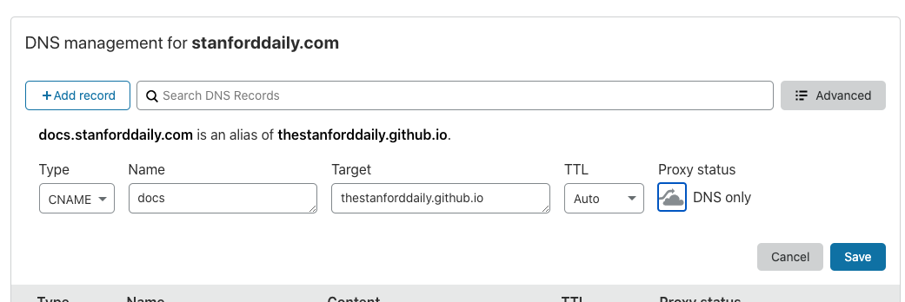
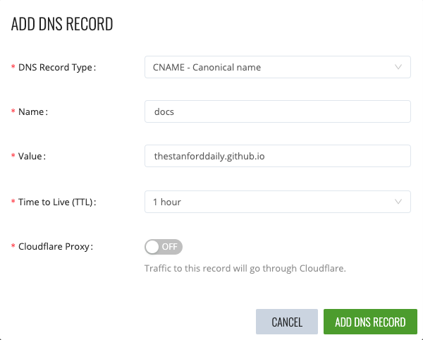

Our DNS records are handled both in Ezoic and Cloudflare. Essentially, we actually use Cloudflare DNS servers, but Ezoic is synced to Cloudflare, meaning that every few hours, it overwrites the records stored at Cloudflare with what

## Adding a new record

This means that when we add a new record, we should do two things:

1. Add a new DNS record in Cloudflare, so that the record immediately starts getting propagated.
1. Add the DNS record in Ezoic, so that the record doesn't get deleted in a few hours.

Below, we demonstrate how to add a CNAME record from docs.stanforddaily.com -> thestanforddaily.github.io for both Cloudflare and Ezoic:

### Cloudflare

Add a DNS record in the "DNS" tab. It's probably safest to set the record to "DNS only" (uncheck the "Proxied" logo) for new DNS records. However, some of our existing sites do have the Cloudflare proxy turned on, so don't change that.

### Ezoic

To add a DNS record, go to the "Settings" tab and then scroll down to the "DNS Settings" section. Here, you can add a new record.

