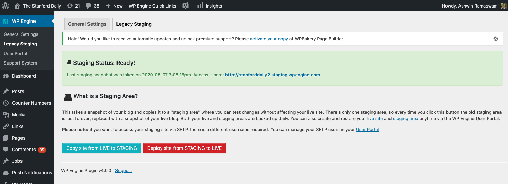
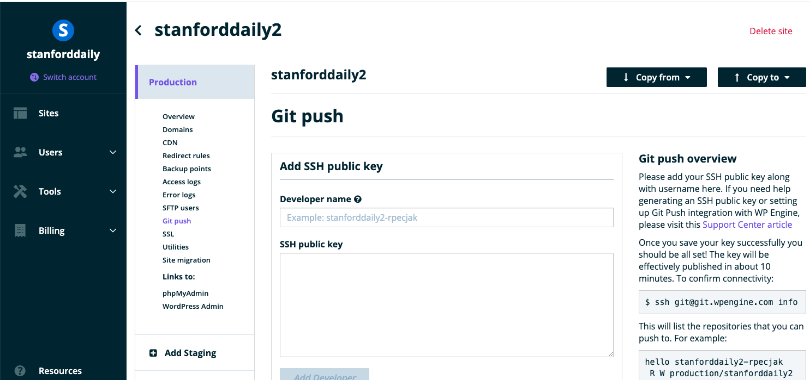

Our backend uses WordPress.

## Local development

Install [Docker Compose](https://docs.docker.com/compose/install/). Then, make sure the Docker daemon is running.

Run the following commands:

```bash
git clone https://github.com/TheStanfordDaily/stanforddaily-wordpress
cd stanforddaily-wordpress
docker-compose up
```

Then, open up [http://localhost:8000/wp-admin/](http://localhost:8000/wp-admin/) in your browser, and you will see the WordPress admin. You should go to the "themes" section and enable the "tsd-headless" theme.

!!! note
    This will work, though you won't be able to see any UI. This is because this is a "headless CMS" -- all the UI is handled by the [React frontend](frontend.md).

### Directory structure

Don't touch any of the default wordpress generated files (`wp-admin`, `wp-includes`, etc.), as they are auto-generated upon WordPress installation. They should only be updated if you decide to upgrade to a new version of WordPress.

### [ads.txt](https://github.com/TheStanfordDaily/stanforddaily-wordpress/blob/master/ads.txt)

This is the file that gets served (with some modifications) at [https://www.stanforddaily.com/ads.txt](https://www.stanforddaily.com/ads.txt).

!!! warning "TODO"
    I'm not sure if this is the actual file -- will need to double check on this - Ashwin

### [wp-content/themes](https://github.com/TheStanfordDaily/stanforddaily-wordpress/blob/master/wp-content/themes)

This directory contains all the themes. The only theme we have is called "TSD Headless" and is located at [wp-content/themes/tsd-headless](https://github.com/TheStanfordDaily/stanforddaily-wordpress/tree/master/wp-content/themes/tsd-headless).

This theme is based on [postlight/headless-wp-starter](https://github.com/postlight/headless-wp-starter) but with a few modifications.

### [wp-content/plugins](https://github.com/TheStanfordDaily/stanforddaily-wordpress/blob/master/wp-content/plugins)

This directory contains all plugins. Some of these are plugins are not developed by us; the ones developed by us are prefixed by `tsd`:

| Plugin folder name      | Description |
| ----------- | ----------- |
|  tsd-jobs  | REST API endpoints for the jobs board. |
|  tsd-json  | Custom REST API endpoints that are used by the React frontend of [https://www.stanforddaily.com](https://www.stanforddaily.com). |
|  tsd-push-notification  | WordPress admin pages for sending push notifications through Expo's push notification service on a specific article |
|  tsd_authors_plugin  | Author information for the mobile app (not in use, should delete) |
|  tsd_plugin_magazine_posts  | Create a "magazine posts" post type on the WordPress admin page (not in use, should delete) |
|  tsd_plugin_rss_digest  | Customizes the RSS feed (not in use since we switched to a hand-written digest in Fall 2019, should delete) |


!!! warning
    Do not install any plugins directly from the WordPress admin console. This makes it harder to keep everything in sync and version plugins in source control. Instead, if you want to add a new WordPress plugin, first download the plugin and then copy the folder to the `wp-content/plugins` folder.

!!! note
    If you create a new plugin and then deploy it, you will need to go to the WordPress Admin console plugins page and then manually enable it.

### [test](https://github.com/TheStanfordDaily/stanforddaily-wordpress/tree/master/test)

This directory contains some end-to-end tests. Right now, we only test the jobs plugin, but we could add more tests in the future.

## Deployment

We deploy our site to WPEngine. Deployment of the website happens automatically to both our staging website and production website through a [GitHub Actions script](https://github.com/TheStanfordDaily/stanforddaily-wordpress/blob/master/.github/workflows/deploy.yml), whenever new code is pushed to master.

### Architecture

WPEngine is a managed WordPress hosting service. The site on WPEngine for our main WordPress website is called `stanforddaily2`. For each of our sites (production and staging), WPEngine creates both a MySQL database and a PHP instance.

Our staging website is available at: [http://stanforddaily2.staging.wpengine.com/wp-admin/](http://stanforddaily2.staging.wpengine.com/wp-admin/)

Our production website is available at: [https://wp.stanforddaily.com/wp-admin/](https://wp.stanforddaily.com/wp-admin/)

### Copying from production to staging

Sometimes you may want to copy data from the production to the staging website. To do so, go to the "WP Engine" tab in WordPress Admin and click "Copy site from LIVE to STAGING" (don't click "Deploy site from STAGING to LIVE"!).

You will need admin access on WordPress to do this.



### Manual deployment

If, for some reason, you need to manually deploy, first [generate a new SSH key using the `ssh-keygen` tool](https://help.github.com/en/github/authenticating-to-github/generating-a-new-ssh-key-and-adding-it-to-the-ssh-agent#generating-a-new-ssh-key) (don't include a passphrase). Then go to the "Git push" section and add the new public key to the list of authorized Git push users.



Finally, you can do the following steps to manually deploy:

```bash
# deploy to staging:
git push git@git.wpengine.com:staging/stanforddaily2.git master
# deploy to production:
git push git@git.wpengine.com:production/stanforddaily2.git master
```

Sometimes your push may be rejected because you need to pull new updates (such as a WordPress maintenance upgrade) from the remote. In this case, first pull the latest changes:

```bash
git pull git@git.wpengine.com:production/stanforddaily2.git master
```

### Secrets

We have one secret in the GitHub repository: `WPENGINE_SSH_PRIVATE_KEY`.

If you need to regenerate the secret (in the event of a secret compromise), follow the steps in the "Manual deployment" section to generate a new SSH key. Then, you can add a new public key to WPEngine with the name "github-actions-deploy".

Set the `WPENGINE_SSH_PRIVATE_KEY` secret to be equal to the value of the generated private key.

### Future improvements

We should add more tests, especially to the `tsd-json` plugin.

## Debug

To debug, here are some useful links:

- [Lambda@edge function production logs](https://console.aws.amazon.com/cloudwatch/home?region=us-east-1#logsV2:log-groups/log-group/$252Faws$252Flambda$252Fus-east-1.c2m3cl8-6zgnou9)