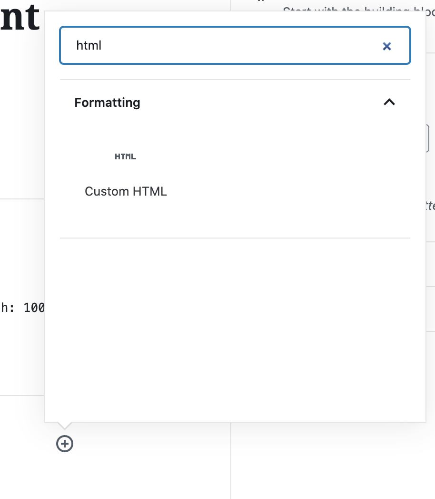

The default frontend for articles doesn't play well with custom scripts or images. A solution for that is to include custom visualizations (such as data visualizations, scrollytelling animations, or other interactive features) as an `iframe`. The [StanfordDaily-DataViz](https://github.com/TheStanfordDaily/StanfordDaily-DataViz) repository hosts all of this content through GitHub Pages.

Here is a sample page that is hosted on StanfordDaily-DataViz: [https://thestanforddaily.github.io/StanfordDaily-DataViz/projects/2020-01-30-laundry/undergrad-grad.html](https://thestanforddaily.github.io/StanfordDaily-DataViz/projects/2020-01-30-laundry/undergrad-grad.html).

!!! warning
    Don't rename the StanfordDaily-DataViz repository, as it will then break all links to existing visualizations that are hosted on GitHub Pages.


## Local development

Install [Node JS](https://nodejs.org/en/).

To work on a project, you just need to `cd` to one of the projects in the StanfordDaily-DataViz.

```bash
npm i -g live-server
git clone https://github.com/TheStanfordDaily/StanfordDaily-DataViz.git
cd stanforddaily-dataviz
live-server
```

Then, open up [http://localhost:8080](http://localhost:8080) in your browser, and you will see a live-reloading preview of this particular data viz.

## Creating a new project

Create a new folder within `projects` which is prefixed by the date and the name of your project. Then, create an `index.html` page -- this will be the main page for the new project.

```bash
cd projects
mkdir 2020-10-08-elections-viz
cd 2020-10-08-elections-viz
echo "hello world" > index.html
```

You can then run `live-server` to view a preview of your new project.

## Deployment

StanfordDaily-DataViz is deployed as a static site hosted on [GitHub Pages](https://pages.github.com/). This means that all deployment is managed automatically.

The path for where the site is hosted is in the format `https://thestanforddaily.github.io/StanfordDaily-DataViz/[path]`. For example, for a project at the path `projects/2020-06-08-title-ix/index.html`, the hosted path is [https://thestanforddaily.github.io/StanfordDaily-DataViz/projects/2020-06-08-title-ix/](https://thestanforddaily.github.io/StanfordDaily-DataViz/projects/2020-06-08-title-ix/).

!!! note
    It will take a few minutes for changes to update the actual deployment, though if you're impatient and want to "bust the cache", just add a query string (such as `?a=1`) to the end of the URL.

Add a "Custom HTML" block:



The block should have the following code to render an iframe (replace the `src` value with the URL to your own visualization):

```html
<iframe id="tsd-custom-iframe" src="https://thestanforddaily.github.io/StanfordDaily-DataViz/projects/2020-06-08-title-ix/index.html" style="border: 0; width: 100%; min-height: 100vh;"></iframe>
```

You can tweak the `min-height: 100vh;` value as needed, if you want the height to be different.

### Hiding the header

If you want to hide the title / header image of the article, also add a HTML block with the following content:

```html
<style>
#main-article-text2 {
margin: 0 !important; width: 100% !important;
} .tsd-article header { display: none; }
</style>
```

In fact, you can add a `<style>` block with any custom CSS you want if you need further customization of the article page.

### Configure GitHub Pages

If GitHub Pages doesn't work or gets disabled for some reason, go to "Settings" -> "GitHub Pages" from the StanfordDaily-DataViz GitHub repository. Make sure that the "Source" option is set to "master" so that it publishes from the master branch.

## Future improvements

!!! note
    Right now, this structure only supports static HTML sites, and we use iframes with a separate repository for projects such as [Modeling the Draw](https://github.com/TheStanfordDaily/modeling-the-draw).

#### Easier embedding

The embedding process is a bit confusing / technical -- it would be better to make this process more seamless, as well as allow iframes to have a dynamic rather than fixed height.

#### Previews

Right now, it's not possible to view previews of articles on [https://www.stanforddaily.com](https://www.stanforddaily.com). For interactive articles, the best we can get is the local development experience of the single HTML file, but we can't preview yet how it looks like when embedded on the main site until the post is actually published.

#### Custom domains

It might be good to host all this content on a custom domain such as [https://interactive.stanforddaily.com](https://interactive.stanforddaily.com) -- [this is possible with GitHub Pages](https://help.github.com/en/github/working-with-github-pages/configuring-a-custom-domain-for-your-github-pages-site). This way, we might be able to even make an article redirect to a completely custom, immersive page rather than having to always embed interactive visualizations using iframes in articles.