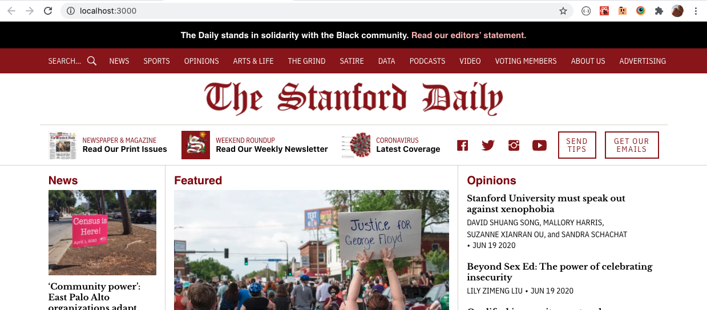
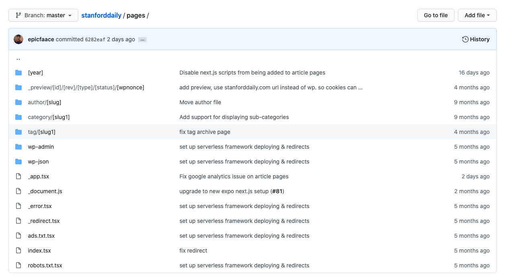

## Local development

Install [Node JS](https://nodejs.org/en/) and [Yarn](https://classic.yarnpkg.com/en/docs/install/#mac-stable).

Run the following commands:

```bash
git clone https://github.com/TheStanfordDaily/stanforddaily.git
cd stanforddaily
yarn
yarn start
```

Then, open up [http://localhost:8000](http://localhost:8000) in your browser, and you will see a live-reloading preview of the local development site.



### Directory structure

This site is built using [Next.js](https://nextjs.org/), meaning that most pages are server-side rendered.

### pages

The `pages` directory contains a list of all the pages, with each file's file path mirroring the path of its corresponding page's URL. Note that pages can have placeholders denoted by brackets, which represent a URL parameter that can then be used by React components to render the right page.



Our main article pages are located at the path [`pages/[year]/[month]/[day]/[slug].tsx`](https://github.com/TheStanfordDaily/stanforddaily/blob/master/pages/author/%5Bslug%5D/index.tsx).

For more information, see [the Next.js documentation on pages](https://nextjs.org/docs/basic-features/pages).

### components

The `pages` directory usually renders a React component that is under the `components` directory -- this is where we store reusable React components that may be used on multiple pages.

### helpers

The `helpers` directory contains extra utility code, such as fetching data from the WordPress API.

If you ever change the WordPress API through the `stanforddaily-wordpress` repository (for example, if you want to show different types of articles on the front page), you should also change [`helpers/tsd-json.json`](https://github.com/TheStanfordDaily/stanforddaily/blob/master/helpers/tsd-json.json) to reflect the new API structure and [`helpers/wpapi.ts`](https://github.com/TheStanfordDaily/stanforddaily/blob/master/helpers/wpapi.ts) to add new API endpoint functions, as needed.

### Ezoic-specific notes

In Spring 2020, we had issues with Ezoic ad scripts interfering with Next.js scripts, which then caused Uber Grids to not work anymore.

To fix this, we decided to disable all Next.js scripts showing up in production on our article pages. For this, we added the experimental `unstable_runtimeJS` parameter to [`pages/[year]/[month]/[day]/[slug].tsx`](https://github.com/TheStanfordDaily/stanforddaily/blob/master/pages/%5Byear%5D/%5Bmonth%5D/%5Bday%5D/%5Bslug%5D.tsx):

```js
export const config = {
  unstable_runtimeJS: false
};
```

What this means, though, is that we cannot run any interactive javascript (such as `componentDidMount` or event handlers) through React on our article pages. Thus, for any extra interactivity, we had to manually add a `<script>` tag into the page instead.

This caused us to [switch away from using react-disqus](https://github.com/TheStanfordDaily/stanforddaily/commit/6282eaf4e95886387d6d65ecde7bd59441c4905a) and [react-ga](https://github.com/TheStanfordDaily/stanforddaily/commit/6282eaf4e95886387d6d65ecde7bd59441c4905a) in favor of manually embedded script tags.

!!! note
    This is a major limitation, but we have worked around this so far by the manually embedded script tags mentioned above. Keep this limitation (and workaround) in mind if you need to add any custom scripts to React pages.

## Deployment

We deploy our site to AWS. Deployment of the website happens automatically to our production website through a [GitHub Actions script](https://github.com/TheStanfordDaily/stanforddaily/blob/master/.github/workflows/deploy.yml), whenever new code is pushed to master.

### Architecture

We deploy using the Serverless Framework. This creates an S3 bucket with static pages and a Lambda@edge function that runs the Next.js server-side rendering code. Both the S3 bucket and the Lambda@edge function are connected to a Cloudfront distribution which actually serves our content.

The current CloudFront distribution for [https://www.stanforddaily.com](https://www.stanforddaily.com) is at [https://d3uak7r5z7qp0p.cloudfront.net/](https://d3uak7r5z7qp0p.cloudfront.net/).

Finally, stanforddaily.com has DNS records (stored in both Ezoic and CloudFlare) that point to this cloudfront distribution (a CNAME record to d3uak7r5z7qp0p.cloudfront.net).

You can view all CloudFront distributions at [https://console.aws.amazon.com/cloudfront/home](https://console.aws.amazon.com/cloudfront/home).

!!! warning
    Please do not make any changes to the CloudFront distributions through the AWS console; instead, do so by modifying `serverless.yml` as mentioned in the next section. Otherwise, the automatic deploys may end up overwriting any manual changes done through the AWS console.

!!! note
    We use the serverless-next.js serverless component for deployment. Please see the link to the [serverless-next.js component](https://github.com/danielcondemarin/serverless-next.js#serverless-nextjs-component) repository to see a full description of the architecture it sets up.


### serverless.yml

The [serverless.yml](https://github.com/TheStanfordDaily/stanforddaily/blob/master/serverless.yml) file configures what is deployed using the serverless-next.js component. It has values such as the following:

```yaml
myNextApplication:
  component: serverless-next.js@1.10.0
  inputs:
    memory: 1024
    cloudfront:
      comment: "Stanford Daily website"
      defaults:
        ttl: 60
        compress: true
        forward:
          headers: 'none'
          cookies: 'none'
          queryString: true
          queryStringCacheKeys: ['s', 'p']
```

Note that everything under the `cloudfront` key controls the deployment of the CloudFront distribution. You can find a reference for acceptable parameters at the documentation for the [aws-cloudfront serverless component](https://github.com/serverless-components/aws-cloudfront).

!!! note
    The `queryStringCacheKeys` parameter is important; it is used so that https://www.stanforddaily.com/, https://www.stanforddaily.com/?p=1168395 (links to a particular post by Disqus), and https://www.stanforddaily.com/?s=search (used for search) are treated as different pages by the cache. Otherwise, by default, CloudFront treats all pages with the same path but different query strings as the same page. 

### Manual deployment

If, for some reason, you need to manually deploy, first install the [AWS CLI](https://aws.amazon.com/cli/) and run `aws configure` to configure the AWS CLI with your AWS account credentials. Then, run the following from the root of the repository:

```bash
yarn
yarn build
yarn deploy
```

### Secrets

We have two secrets in the GitHub repository: `AWS_ACCESS_KEY_ID` and `AWS_SECRET_ACCESS_KEY`.

If you need to regenerate the secrets (in the event of an AWS account compromise), create a new IAM user, create credentials for that user, and then set the secrets for that user in the [GitHub repository settings page](https://github.com/TheStanfordDaily/stanforddaily/settings/secrets).

!!! note
    Only repository admins can edit secrets.

### Future improvements

#### Staging site

It would be nice to create a staging site at [http://beta.stanforddaily.com](http://beta.stanforddaily.com) where we can automatically deploy the latest changes from master, and then only selectively deploy the branch to production after testing. Right now, we have no testing phase because changes on master are deployed directly to production.

#### Tests

We should also add unit tests / snapshot tests using [Jest](https://jestjs.io/). This will make sure we don't have any unexpected regressions.